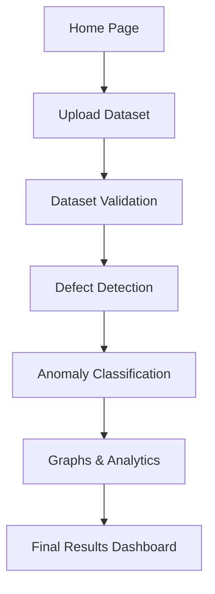
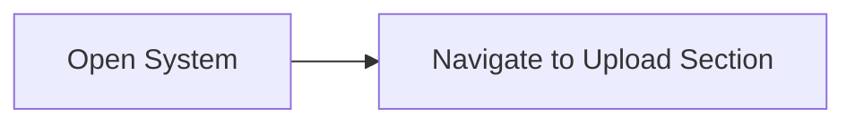
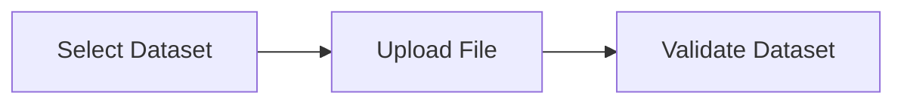
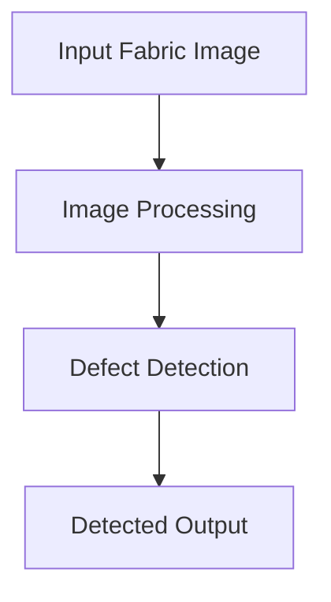
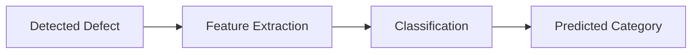
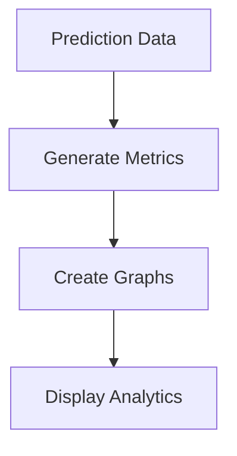
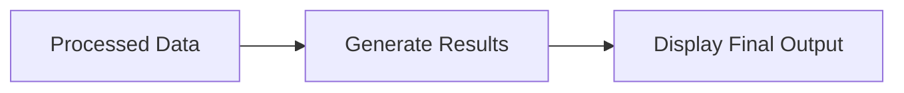

# Textile Defect Analysis System Workflow

## Complete Workflow

---

# 1. Home Page

The starting interface of the system where users begin the textile defect analysis process.

## Workflow

## Screenshot

---

# 2. Upload Dataset

Users upload textile fabric datasets/images for inspection.

## Workflow

## Screenshot

---

# 3. Defect Detection

The system scans uploaded textile images to identify defects.

## Workflow

## Screenshot

---

# 4. Anomaly Classification

Detected defects are classified into specific categories.

## Workflow

## Screenshot

---

# 5. Graphs & Analytics

The system generates analytical visualizations from prediction data.

## Workflow

## Screenshot

---

# 6. Final Results Dashboard

Displays the final prediction and defect analysis summary.

## Workflow

## Screenshot

---

# Overall Architecture Flow

---
